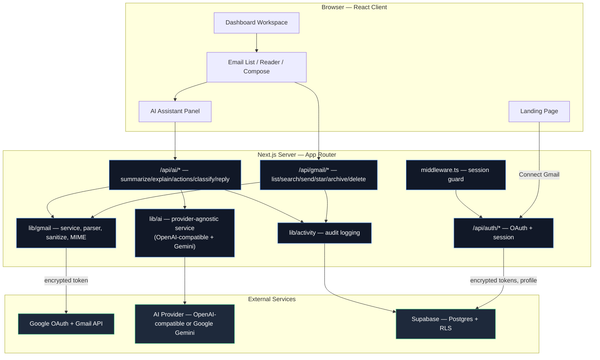

<div align="center">

# Veltrix AI

### Your inbox, intelligently simplified.

**An AI-powered email workspace connected to real Gmail via Google OAuth — summarize, explain, extract actions, and draft replies without ever leaving the reading view.**
No mocked data. No fake buttons. Every Gmail action and AI call is real, server-side, and auditable.

<br/>

[](https://nextjs.org/)
[](https://react.dev/)
[](https://www.typescriptlang.org/)
[](https://tailwindcss.com/)
[](https://supabase.com/)
[](https://developers.google.com/gmail/api)
[](https://developers.google.com/identity/protocols/oauth2)
[](https://ai.google.dev/)

<br/>

</div>

---

## Overview

**Veltrix** is a production-grade email assistant that connects securely to a real Gmail account through Google OAuth and the Gmail API, then layers a provider-agnostic AI service on top of it — summarization, plain-language explanations, action-item extraction, classification, and tone-controlled reply drafting.

```
"Summarize this email"        ──▶  2–4 sentence summary + key points + deadline + people mentioned
"Explain this email"          ──▶  what it's about · what's wanted · risks · suggested next step
"Extract action items"        ──▶  structured task list with due dates
"Generate Reply — Professional" ──▶  editable draft in an inline composer, never auto-sent
```

Veltrix is built as a calm, focused productivity application — minimalist, restrained, high information density without clutter — rather than another generic AI dashboard bolted onto an inbox.

---

## Key Features

|  | Feature |
|---|---------|
| 🔐 **Real Google OAuth** | Full authorization-code flow with CSRF-safe state, encrypted token storage, and automatic refresh — no Gmail password ever touches Veltrix. |
| 📥 **Real Gmail Integration** | List, read, search, star, mark read/unread, archive, delete, and send — all through the live Gmail API, scoped to the minimum necessary OAuth grants. |
| 🧵 **Thread-Based Reading** | Gmail-style collapsible thread view with a dedicated, distraction-free reader pane. |
| ✨ **AI Summarization** | Structured summary, key points, an action-required flag, detected deadline, and people mentioned — with explicit uncertainty flagging instead of invented facts. |
| 💬 **AI Reply Generation** | Tone-controlled (Professional / Friendly / Formal / Concise / Custom) drafts grounded in the original email and recent thread context — always editable, never auto-sent. |
| 🔁 **Pluggable AI Providers** | Ships with both an OpenAI-compatible provider and **Google Gemini** behind one provider-agnostic interface — swap models via a single environment variable. |
| 🔍 **Explain This Email** | Plain-language breakdown: what it's about, what the sender wants, expected action, dates, and risks. |
| ✅ **Action Item Extraction** | Tasks and deadlines pulled directly from email text into a structured checklist. |
| 🏷️ **AI Classification** | Optional, explainable categorization (Important, Work, Finance, Meetings, Promotions, and more). |
| 🗂️ **Activity History** | An auditable log of every AI action and mailbox change — summaries generated, replies drafted, emails sent/archived/deleted. |
| 🛡️ **Supabase + Row Level Security** | Every table scoped so a user can only ever see their own data; OAuth tokens are AES-256-GCM encrypted at rest. |
| 🎨 **Light & Dark Mode** | Deliberately composed dark theme (not a simple inversion) built on a proper design-token system. |
| 📱 **Fully Responsive** | Three-pane desktop workspace, two-pane tablet layout, single-pane mobile flow with bottom-sheet navigation. |

---

## Tech Stack

| Layer | Technology | Notes |
|-------|-----------|-------|
| **Framework** | Next.js (App Router) | Server Components + Route Handlers |
| **UI** | React · TypeScript (strict) | `@/*` path alias to the project root |
| **Styling** | Tailwind CSS | Custom design-token system, light/dark CSS variables |
| **API Layer** | Next.js Route Handlers | `/api/auth/*`, `/api/gmail/*`, `/api/ai/*`, `/api/activity`, `/api/settings` |
| **Gmail** | `googleapis` + `google-auth-library` | Real OAuth 2.0, automatic token refresh, MIME send |
| **AI** | Provider-agnostic service layer | Ships with an OpenAI-compatible provider **and Google Gemini**; swapping vendors touches one file |
| **Auth + DB** | Supabase (Postgres) | Row Level Security, encrypted token storage |
| **Session** | Signed, httpOnly cookies (`jose`) | Contains identity + an account reference — never a Google token |
| **Sanitization** | `isomorphic-dompurify` | Untrusted email HTML is sanitized server-side before rendering |
| **Icons** | lucide-react | Consistent line-icon set throughout |

> **Architecture note:** the Gmail service layer, AI abstraction, and activity logging are each isolated in `lib/`, so route handlers stay thin — verify session, validate input, call the service, log activity, return a uniform response envelope. The AI layer ships with two interchangeable providers — an OpenAI-compatible client and **Google Gemini** — selected at runtime via `AI_PROVIDER`, with no changes required anywhere else in the codebase.

---

## System Architecture



---

## OAuth Flow

```mermaid
flowchart LR
    A["Landing Page"] --> B["Connect Gmail"]
    B --> C["Google OAuth"]
    C --> D["Google Consent Screen"]
    D --> E["Authorization Code"]
    E --> F["Backend Token Exchange"]
    F --> G["Encrypted Token Storage"]
    G --> H["Gmail API"]
    H --> I["Application Dashboard"]

    style A fill:#1A56DB,color:#fff
    style F fill:#233343,color:#fff
    style G fill:#5A9BFF,color:#fff
```



Refresh tokens and access tokens never reach the browser — only a signed session cookie referencing the encrypted, server-side token row is issued to the client.

---

## Project Structure

```
Veltrix/
├── app/
│   ├── page.tsx                     # Landing page
│   ├── dashboard/
│   │   ├── inbox/ · sent/ · starred/ · archive/ · trash/ · drafts/ · important/
│   │   ├── search/                  # Gmail-backed search results
│   │   ├── activity/                # AI + mailbox audit history
│   │   └── settings/                # Account, AI preferences, disconnect flow
│   └── api/
│       ├── auth/                    # google, callback, logout, session
│       ├── gmail/                   # messages, threads, search, send, star, read, archive, delete
│       ├── ai/                      # summarize, explain, actions, classify, reply
│       ├── activity/
│       └── settings/
├── components/
│   ├── layout/                      # AppShell, Sidebar, Topbar, MobileNavigation
│   ├── email/                       # EmailList, EmailRow, EmailReader, EmailThread, ComposeEmail, SearchBar
│   ├── ai/                          # AIAssistantPanel, AISummary, AIExplain, AIActionItems, AIReply
│   └── ui/                          # Button, Dialog, Toast, Skeleton
├── lib/
│   ├── auth/                        # session cookies, Google OAuth client, token encryption
│   ├── gmail/                       # service layer, parser, sanitizer, MIME builder
│   ├── ai/
│   │   ├── ai.service.ts            # provider-agnostic entry points
│   │   ├── providers/               # openai.provider.ts, gemini.provider.ts
│   │   └── prompts/                 # summarize, reply, explain, classify, actions
│   ├── activity/                    # audit logging
│   ├── supabase/                    # RLS-respecting + service-role clients
│   ├── validation/                  # Zod request schemas
│   └── utils/                       # response envelope, logger, rate limiter
├── types/                           # gmail.ts, ai.ts, auth.ts, database.ts
├── hooks/                           # useGmail, useEmail, useAI, useSearch
├── supabase/migrations/             # schema + Row Level Security
├── tests/unit/                      # parser, sanitizer, validation coverage
├── docs/                            # architecture, oauth, gmail-api, database, ai, security, deployment
└── .env.example
```

---

## Getting Started

### Prerequisites

- **Node.js 18.18+**
- A Google Cloud project with the Gmail API enabled
- A Supabase project
- An API key for an OpenAI-compatible AI provider

### Installation

```bash
# 1. Clone the repository
git clone https://github.com/Premkumar1845/Veltrix-AI.git
cd Veltrix-AI

# 2. Install dependencies
npm install

# 3. Configure environment
cp .env.example .env.local        # then fill in your keys — see docs/oauth.md and docs/database.md

# 4. Run the dev server
npm run dev
```

Open **http://localhost:3000** and click **Connect Gmail**.

---

## Environment Variables

| Variable | Required | Purpose |
|----------|:--------:|---------|
| `GOOGLE_CLIENT_ID` / `GOOGLE_CLIENT_SECRET` / `GOOGLE_REDIRECT_URI` | ✅ | Google OAuth 2.0 — see `docs/oauth.md` |
| `SESSION_SECRET` | ✅ | Signs the session cookie |
| `TOKEN_ENCRYPTION_KEY` | ✅ | AES-256-GCM key for encrypting stored OAuth tokens (`openssl rand -hex 32`) |
| `NEXT_PUBLIC_SUPABASE_URL` / `NEXT_PUBLIC_SUPABASE_ANON_KEY` / `SUPABASE_SERVICE_ROLE_KEY` | ✅ | Supabase — see `docs/database.md` |
| `AI_PROVIDER` | ✅ | `openai` or `gemini` — selects the active AI provider |
| `AI_API_KEY` | ✅ | API key for whichever provider `AI_PROVIDER` selects |
| `AI_MODEL` | ✅ | Model name for the selected provider (e.g. `gpt-4o-mini` or `gemini-1.5-flash`) |
| `DEMO_MODE` | optional | Must be `false` outside local review |

> `.env.local` is **gitignored** — secrets are never committed. Only `.env.example` (names, no values) is tracked.

---

## Database Setup

1. Open your Supabase project → **SQL Editor** → **New query**.
2. Paste and run [`supabase/migrations/0001_init.sql`](supabase/migrations/0001_init.sql).

This creates `profiles`, `connected_accounts`, `user_preferences`, `ai_activity`, `email_activity`, and `ai_generated_replies`, enables **Row Level Security** on every table, and scopes access to `auth.uid() = user_id`.

Gmail itself remains the source of truth for mail — Veltrix never mirrors your mailbox into Supabase; only application-level data (preferences, encrypted token references, audit history) is stored.

---

## API Reference

### `GET /api/gmail/messages?view=inbox`
Lists messages for a mailbox view (`inbox`, `starred`, `important`, `sent`, `drafts`, `archive`, `trash`), paginated via `pageToken`.

### `GET /api/gmail/search?q=from:jane@example.com`
Real Gmail-backed search — supports the full Gmail query syntax (`from:`, `subject:`, `has:attachment`, `after:`, `before:`, `is:unread`, etc.).

### `POST /api/gmail/send`
```jsonc
{ "to": ["jane@example.com"], "subject": "Re: Project update", "bodyHtml": "<p>Sounds good.</p>" }
```
Sends via the Gmail API using a signed-in user's own account. Always requires explicit confirmation client-side — nothing is auto-sent.

### `POST /api/ai/summarize`
```jsonc
{ "messageId": "18c2f1a4b9d..." }
// → { summary, keyPoints[], actionRequired, deadline, peopleMentioned[], uncertain }
```

### `POST /api/ai/reply`
```jsonc
{ "messageId": "18c2f1a4b9d...", "tone": "professional", "instruction": "Confirm Tuesday works" }
// → { reply } — returned into an editable composer, never sent automatically
```

### `POST /api/ai/explain` · `POST /api/ai/actions` · `POST /api/ai/classify`
Plain-language breakdown, structured action items, and an explainable category — each scoped to a single `messageId` owned by the authenticated session.

Every `/api/ai/*` route runs through the same provider-agnostic service regardless of which AI backend is configured — set `AI_PROVIDER=gemini` with a valid `AI_API_KEY`/`AI_MODEL` to run entirely on Google Gemini instead of an OpenAI-compatible endpoint, with no other code changes.

All routes return a uniform envelope (`{ ok: true, data }` or `{ ok: false, error }`) and validate every input with Zod before it touches Gmail or the database.

---

## Security

- 🔒 **Server-only secrets** — client secrets, service-role keys, and AI API keys never reach the browser bundle (`import "server-only"` throughout `lib/`).
- 🔑 **Encrypted tokens** — Google access/refresh tokens are AES-256-GCM encrypted before they're ever written to Supabase.
- 🍪 **Signed sessions** — an httpOnly, `SameSite=Lax` cookie carries identity and an account reference only — never a token.
- 🛡️ **Row Level Security** — every Supabase table scoped to `auth.uid() = user_id`.
- 🧼 **Sanitized email HTML** — untrusted email content is run through DOMPurify server-side (scripts, iframes, forms, and `javascript:` URIs stripped) before it ever reaches the browser.
- 🚦 **Rate limiting** — a sliding-window limiter applied to every Gmail and AI route.
- 🧾 **Safe error responses** — no stack traces or internal details ever reach the client.
- 🤖 **AI safety** — AI never sends, deletes, or archives on its own; every consequential action requires an explicit user click.

See [`docs/security.md`](docs/security.md) for the full breakdown.

---

## Roadmap

- [x] Real Google OAuth + Gmail API integration (list, read, search, send, star, archive, delete)
- [x] Provider-agnostic AI service (summarize, explain, extract actions, classify, generate reply)
- [x] Supabase persistence with Row Level Security
- [x] Responsive three-pane desktop / two-pane tablet / single-pane mobile layouts
- [ ] Multi-account Gmail support
- [ ] Calendar-aware scheduling suggestions in AI replies
- [ ] Team/shared inbox support
- [ ] Usage analytics dashboard
- [ ] Self-hostable Docker image

---

## Contributing

Issues and pull requests are welcome. Please open an issue describing the change before submitting a large PR, and make sure `npm run lint`, `npm run typecheck`, and `npm run test` all pass locally first.

---

<div align="center">

**Veltrix** — built by [Premkumar1845](https://github.com/Premkumar1845)

Veltrix is an independent application and is not affiliated with Google.

</div>
